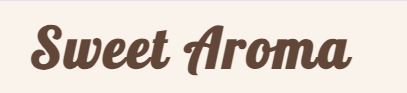

---

# *Sweet Aroma* 

The Sweet Aroma website allows visitors to learn more about the bakery and the products that it offers. This website is targeted to anyone who loves cakes, pastries, and treats for any and every occasion. Visitors can use the contact form to find out more information.

The website can be accessed through this [link]()

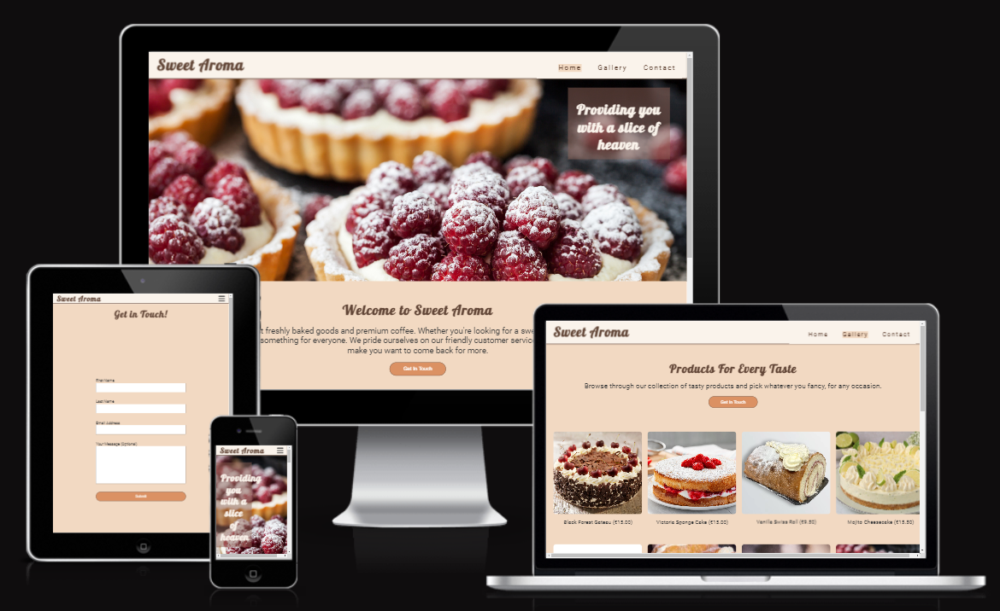

---

## Features
### Favicon
* A favicon of a birthday cake is displayed in the tab of the website along with the name.

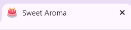

## Navigation 
* Featured at the top of the page, the navigation bar shows the name of the bakery in the left corner: Sweet Aroma. If the user hovers over it with the mouse, it will turn from brown to orange, indicating that it is a link and can be clicked. The logo will take the user to the Home Page.
* The other navigation links are to the right: Home, Gallery and Contact which link to the Home, Gallery and Contact pages respectively. 
* The navigation makes it easy for the user to find their way to the different pages of the website.

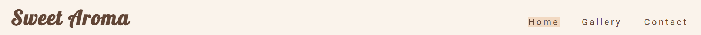
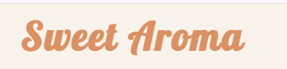

## Home Page
* The Home Page gives information about the company and what it does
* Illustrates the type of products the bakery provides 
* Provides easy navigation to the other links and pages

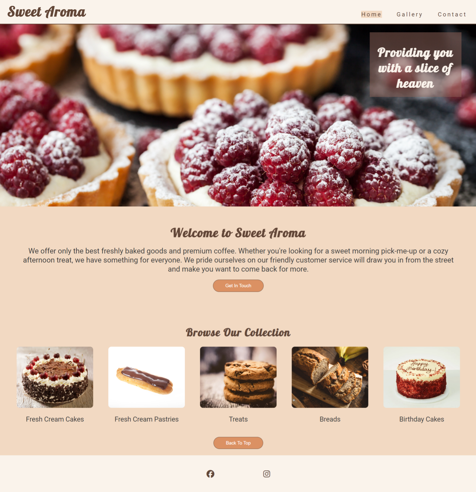

## The Header
* The Header shows a picture of raspberry tarts with a slogan of "Providing you with a slice of heaven". It shows the user  a insight into what they can expect from the bakery.

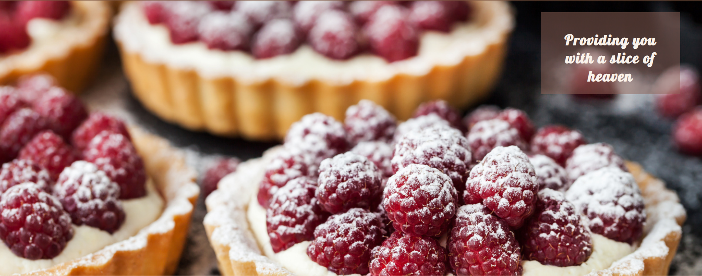

## The Main Section
* In the main section, there is an about us section which details what the bakery offers customers and underneath there is a "Get in Touch!" button that when clicked on will bring users to the Contact page.
* There is a small gallery which illustrates the products that the bakery offers such as: Fresh Cream Cakes, Fresh Cream Pastries, Treats, Breads and Birthday Cakes.
* A "Back to Top" button allows the user to go back to the top of the page without scrolling.

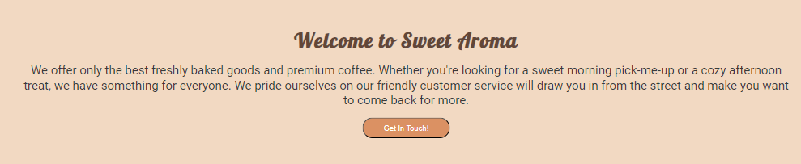
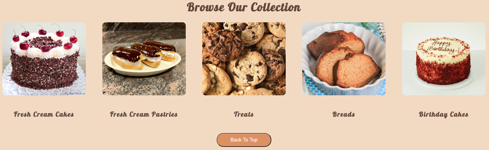

## The Footer Section
* The footer contains icons for Facebook and Instagram that link to those websites respectively. When hovered over they will increase in size to show they can be clicked on. 

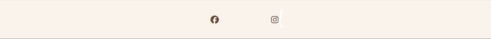

## Gallery Page
* The Gallery Page contains the same navigation bar and footer as the Home Page for easy use.
* It also contains a "Get in Touch!" under the introductory message that links to the Contact Page.
* The Gallery contains images of the products that the bakery offers, as well as the prices for each item.
* The Gallery is responsive to the user's screen and will display as appropriate.
* A "Back to Top" is displayed underneath the gallery to allow users to go back to the top of the page.

## The Contact Page 
* The Contact Page has a contact form for users to fill out.
* Each of the input fields has labels of: First Name, Last Name and Email.
* There is a textarea field for the message which is optional
* All the input fields have a required attribute to ensure users fill out these fields.
* The form is responsive on all screens
* The submit button leads to the response page.

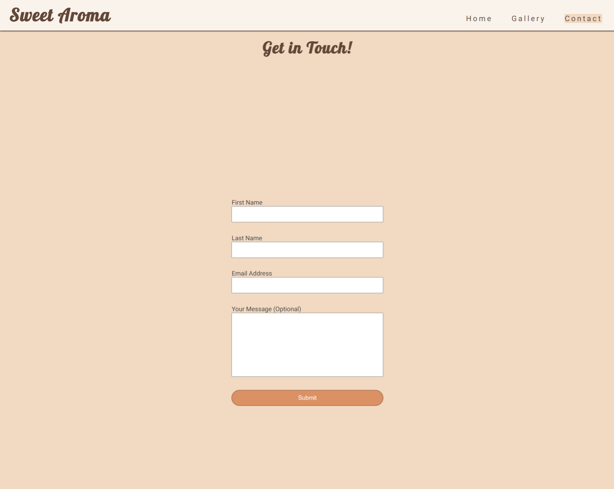

## The Response Page 
* The response page appears after the contact form is submitted
* It contains a thank you and be in touch shortly message

---

## Technologies Used 
* [HTML](https://developer.mozilla.org/en-US/docs/Web/HTML): for building the structure of the website
* [CSS](https://developer.mozilla.org/en-US/docs/Web/css): for used for styling the elements and layout of the website
* [CSS Flexbox](https://developer.mozilla.org/en-US/docs/Learn/CSS/CSS_layout/Flexbox): to set items to shrink or grow to fit the space available
* [CSS Grid](https://developer.mozilla.org/en-US/docs/Web/CSS/grid): to make the gallery responsive
* [Gitpod](https://gitpod.io) editor used to write and edit the code
* [Git](https://git-scm.com/): was used for the version control of the website
* [GitHub](https://github.com/): was used to host the code of the website
* [Snipping Tool](https://support.microsoft.com/en-us/windows/use-snipping-tool-to-capture-screenshots-00246869-1843-655f-f220-97299b865f6b): was used to edit and resize images for README file

## Testing 
* I tested this website on the Google Chrome and Microsoft Edge browsers
* I confirmed that the website functions correctly on all screen sizes using Chrome Devtools.
* The different sections of the website are easy to read and understand
* The form works correctly, where the user must fill out the input fields and the submit button works as well.

## Bugs 
* There were no bugs when I deployed my project to GitHub pages

## Validator Testing
* An error occured in the Index page when I passed the code through the W3C Validator
* Error: The element a must not appear as a descendant of the button element.
* I corrected this error by switching by making the button a descendent of the a element
* There was no errors in the CSS when it passed through the CSS Jigsaw Validator

---

## Deployment 
* This site was deployed to GitHub pages. I used the following steps to do so: 
 * In the [GitHub](https://github.com/alison546/sweet-aroma), click on the Settings tab at the end of nav bar
 * 

