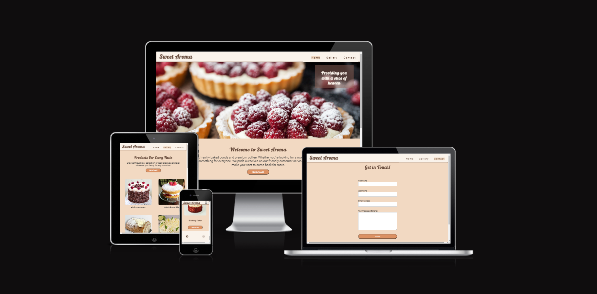

---

# *Sweet Aroma* 

The Sweet Aroma website allows visitors to learn more about the bakery and the products that it offers. This website is targeted to anyone who loves cakes, pastries, and treats for any and every occasion. Visitors can use the contact form to find out more information.

The website can be accessed through this [link](https://alison546.github.io/sweet-aroma/)

---

## Features

## Navigation 
* Featured at the top of the page, the navigation bar shows the name of the bakery in the left corner: Sweet Aroma. If the user hovers over it with the mouse, it will turn from brown to orange, indicating that it is a link and can be clicked. The logo will take the user to the Home Page.
* The other navigation links are to the right: Home, Gallery and Contact which link to the Home, Gallery and Contact pages respectively. 
* The navigation makes it easy for the user to find their way to the different pages of the website.

## The Header
* The Header shows a picture of raspberry tarts with a slogan of "Providing you with a slice of heaven". It shows the user  a insight into what they can expect from the bakery.

## The Main Section
* In the main section, there is an about us section which details what the bakery offers customers and underneath there is a "Get in Touch!" button that when clicked on will bring users to the Contact page.
* There is a small gallery which illustrates the products that the bakery offers such as: Fresh Cream Cakes, Fresh Cream Pastries, Treats, Breads and Birthday Cakes.
* A "Back to Top" button allows the user to go back to the top of the page without scrolling

